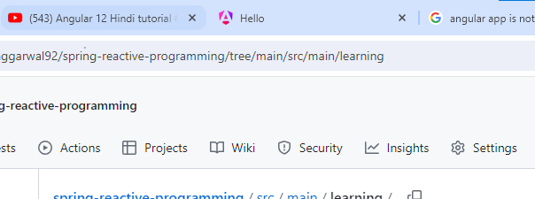
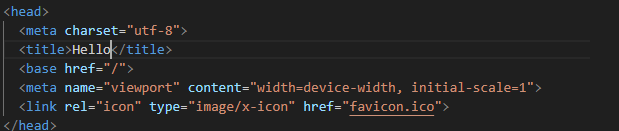
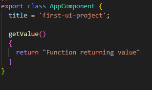
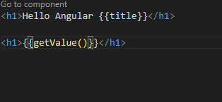
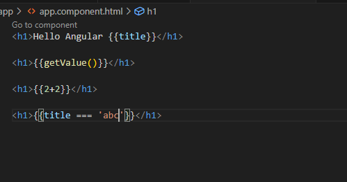

## Change Page Title

As per this page title is Hello. if we want to change this then open index.html file 

## Interpolation

- In the class we have properties and function. Which is also called dynamic data. In order to use these in html file we use interpolation {{property}} or {{getFunction()}}

title can be used using {{title}}

- Can also be use for doing any airthematic/equality operation direcly on html file

- Can aslo be used for below

        <h1 class={{title}}>hello</h1>
        here class name would be title name

-- Thing we cant do inside interpolation are:

        // assignment to new value Not allowed
        {{title="abc"}}
        // We can not check typeOf
        {{typeOf title}}
        // increment and decrement not allowed
        {{data++}}
        // new keyword cant be used

